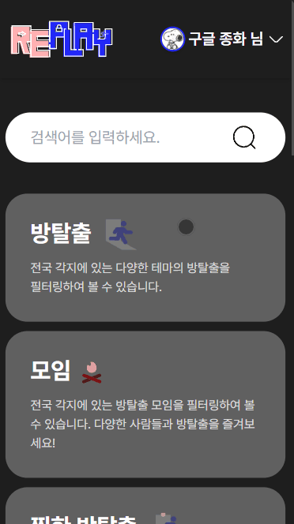
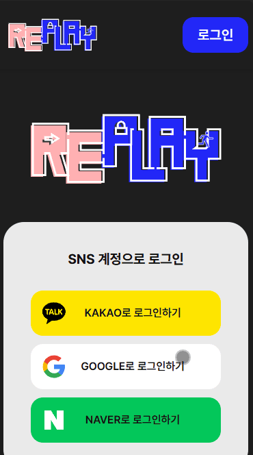
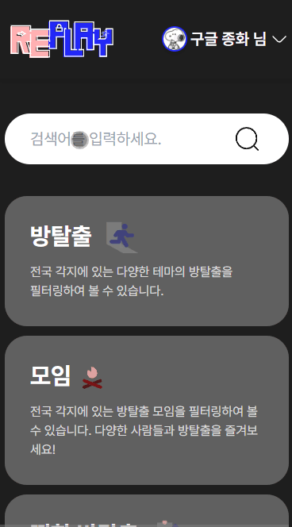
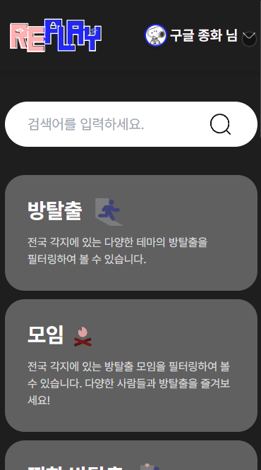
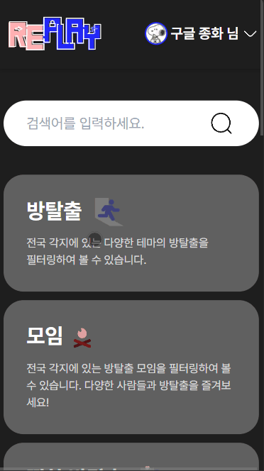
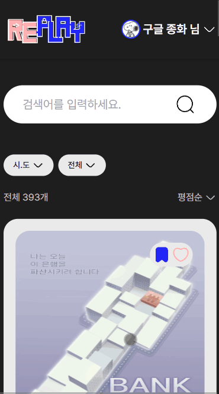
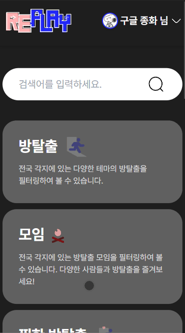
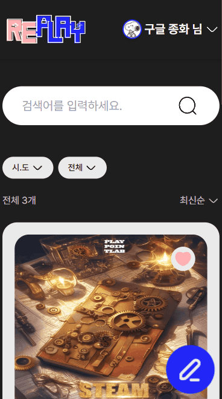
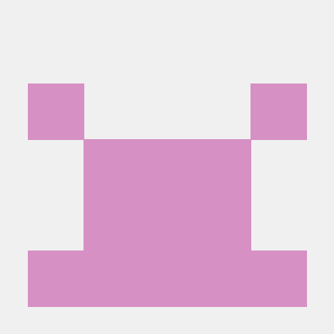

<br>

# 🎯 Re:Play Web Frontend

> 전국 방탈출 정보와 사용자의 리뷰를 공유하고 마음이 맞는 사람들과 함께 방탈출을 즐기도록 모임을 만들 수 있는 서비스

<br>

## ⚙️ 기술 스택

<table align="center">
  <thead>
    <tr align="center">
      <th style="width: 20%; text-align: center;"> Framework </th>
      <th style="width: 20%; text-align: center;"> Language </th>
      <th style="width: 20%; text-align: center;"> State Management </th>
      <th style="width: 20%; text-align: center;"> UI </th>
      <th style="width: 20%; text-align: center;"> HTTP Client </th>
    </tr>
  </thead>
  <tbody>
    <tr align="center">
      <td style="text-align: center;">Next.js 14 (App Router)</td>
      <td style="text-align: center;">TypeScript</td>
      <td style="text-align: center;">TanStack Query (server)<br> Zustand (client)</td>
      <td style="text-align: center;">Tailwind-CSS<br> radix-ui</td>
      <td style="text-align: center;">Axios</td>
    </tr>
  </tbody>
</table>

<br>

## 🖥️ 페이지 구조

<table align="center">
  <thead>
    <tr align="center">
      <th style="width: 25%; text-align: center;"> 홈 페이지 </th>
      <th style="width: 25%; text-align: center;"> 로그인 페이지 </th>
      <th style="width: 25%; text-align: center;"> 검색 페이지 </th>
      <th style="width: 25%; text-align: center;"> 마이 페이지 </th>
    </tr>
  </thead>
  <tbody>
    <tr align="center">
      <td style="text-align: center;"></td>
      <td style="text-align: center;"></td>
      <td style="text-align: center;"></td>
      <td style="text-align: center;"></td>
    </tr>
  </tbody>
</table>

<table>
  <thead>
    <tr align="center">
      <th style="width: 25%; text-align: center;"> 방탈출 목록 페이지 </th>
      <th style="width: 25%; text-align: center;"> 방탈출 상세 페이지 </th>
      <th style="width: 25%; text-align: center;"> 모임 목록 페이지 </th>
      <th style="width: 25%; text-align: center;"> 모임 상세 페이지 </th>
    </tr>
  </thead>
  <tbody>
    <tr align="center">
      <td style="text-align: center;"></td>
      <td style="text-align: center;"></td>
      <td style="text-align: center;"></td>
      <td style="text-align: center;"></td>
    </tr>
  </tbody>
</table>

<br>

## 📐 폴더 구조

```
src/
 ├─ app/                # App Router 기반 페이지
 ├─ axios/              # 기능별 API 호출 코드
 ├─ components/         # UI 컴포넌트
 ├─ constants/          # 상수 리스트
 ├─ data/               # 캐러셀 초기 데이터, mock 데이터
 ├─ hooks/
 │    ├─ form/          # react-hook-form 관련 커스텀 훅
 │    └─ reactQuery/    # TanStack Query 훅
 ├─ libs/               # axiosInstance, queryClient 등
 ├─ store/              # Zustand 스토어
 ├─ styles/             # CSS 파일(globals.css 등)
 ├─ types/              # TypeScript 타입 정의
 └─ utils/              # 유틸리티 함수 (날짜, 숫자 포맷)
```

<br>

## 🔐 로그인 인증(세션) 흐름

Re:Play는 **소셜 로그인(OAuth2)** 방식으로 인증을 처리하며, 자체 회원가입은 없습니다.  
로그인 후 Access Token과 Refresh Token을 기반으로 세션을 유지합니다.

### 로그인 과정

1. 사용자가 소셜 로그인 버튼 클릭 → `window.open()`으로 OAuth 인증 팝업 생성
2. 인증 성공 시, 백엔드에서 `postMessage`로 `accessToken`을 프론트엔드로 전달
3. Zustand(`useAuthStore`)에 `accessToken` 저장
4. 글로벌 네비게이션(GlobalNav)에서 `useUserInfo()` 훅을 통해 `/user/me` API 호출
5. TanStack Query에 `userInfo` 캐싱 → 로그인 상태 유지

### 로그인 주요 파일

- `src/libs/axiosInstance.ts` → Axios 인스턴스 + 인터셉터
- `src/store/authStore.ts` → Zustand 전역 인증 상태
- `src/hooks/reactQuery/useUserInfo.ts` → 사용자 정보 쿼리 훅
- `src/app/(auth)/login/page.tsx` → 로그인 UI

### Access Token

- 상태 관리: Zustand (`useAuthStore`)
- 저장 방식: localStorage (persist 사용)
- API 요청 시 Axios 인터셉터를 통해 `Authorization: Bearer {token}` 자동 추가

### Refresh Token

- 저장 방식: httpOnly Cookie (서버 설정)
- 브라우저에서 직접 접근 불가 → 보안 강화
- Axios 요청 시 `withCredentials: true`로 자동 전송

### 토큰 갱신 흐름

1. API 요청 → Access Token 만료 → 401 응답
2. Axios Response Interceptor → `refreshAccessToken()` 실행
3. `/auth/refresh` API 호출 (withCredentials)
4. 성공 → 새 Access Token → 상태 갱신 → 원래 요청 재시도
5. 실패 → Access Token 초기화 → 로그인 페이지로 이동

### 로그아웃

- `POST /auth/logout` API 호출
- Zustand에서 `accessToken` 초기화 후 홈으로 리다이렉트

<br>

## 👥 팀 소개

<table align="center">
  <thead>
    <tr align="center">
      <th style="text-align: center;"> <a href="https://github.com/KJongHwa">김종화</a> </th>
      <th style="text-align: center;"> <a href="https://github.com/rave189">김재연</a> </th>
    </tr>
  </thead>
  <tbody>
    <tr align="center">
      <td style="width:150px; height:150px; text-align: center;">  </td>
      <td style="width:150px; height:150px; text-align: center;">  </td>
    </tr>
    <tr align="center">
      <td style="text-align: center;">프론트엔드 개발자</td>
      <td style="text-align: center;">백엔드/서버 개발자</td>
    </tr>
  </tbody>
</table>
